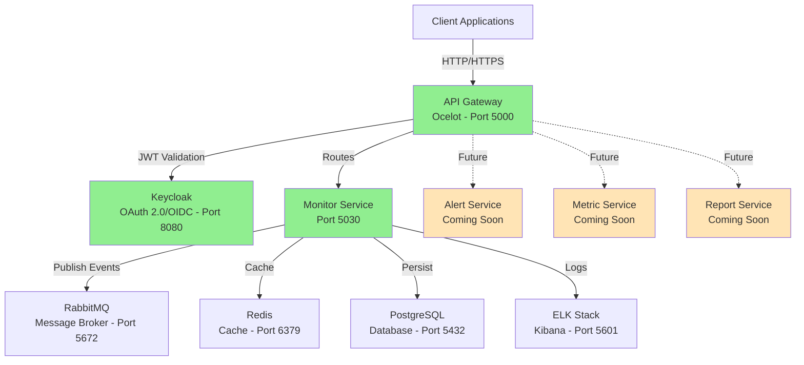

<div align="center">

# Distributed Monitoring System
### Sistema de Monitoramento Distribuído

[](https://dotnet.microsoft.com/)
[](https://www.docker.com/)
[](https://www.postgresql.org/)
[](https://www.rabbitmq.com/)
[](https://redis.io/)
[](https://www.elastic.co/)
[](LICENSE)

**[English](#english)** | **[Português](#português)**

*Enterprise-grade microservices architecture demonstrating modern backend development practices*

*Arquitetura de microserviços enterprise demonstrando práticas modernas de desenvolvimento backend*

</div>

---

<a name="english"></a>
## 🌍 English

### 📋 Overview

A production-ready distributed monitoring and alerting system built with .NET 10 microservices architecture. This project showcases advanced backend development concepts including Clean Architecture, event-driven communication, distributed caching, observability with ELK Stack, and OAuth 2.0 authentication with Keycloak.

### ✨ Key Features

#### 🎯 Functional Features
- **Real-time Monitoring** - Track system metrics (CPU, Memory, Disk, Network)
- **Intelligent Alerting** - Automated notifications based on configurable rules
- **Historical Analytics** - Time-series data storage and trend analysis
- **Automated Reporting** - Scheduled reports in multiple formats (PDF, CSV, JSON)
- **Multi-tenant Support** - Isolated monitoring for different environments

#### 🔧 Technical Features
- **Microservices Architecture** - Independent, scalable services
- **Event-Driven Communication** - Asynchronous messaging with RabbitMQ
- **Distributed Caching** - High-performance Redis caching with TTL
- **Centralized Logging** - ELK Stack (Elasticsearch, Logstash, Kibana)
- **API Gateway** - Unified entry point with Ocelot (rate limiting, circuit breaker)
- **OAuth 2.0 / OIDC** - Enterprise authentication with Keycloak
- **Health Checks** - Comprehensive service monitoring
- **Swagger/OpenAPI** - Interactive API documentation

### 🏗️ Architecture



### 🛠️ Tech Stack

#### Core Technologies
| Technology | Version | Purpose |
|------------|---------|---------|
| **.NET** | 10.0 | Runtime framework |
| **C#** | 12 | Programming language |
| **ASP.NET Core** | 10.0 | Web API framework |
| **Entity Framework Core** | 10.0 | ORM for database access |

#### Infrastructure
| Component | Technology | Port | Purpose |
|-----------|------------|------|---------|
| **Database** | PostgreSQL 16 | 5432 | Primary data store |
| **Message Broker** | RabbitMQ 3.12 | 5672, 15672 | Async communication |
| **Cache** | Redis 7 | 6379 | Distributed caching |
| **API Gateway** | Ocelot | 5000 | Routing, rate limiting |
| **Identity Provider** | Keycloak 23 | 8080 | OAuth 2.0 / OIDC |
| **Search & Analytics** | Elasticsearch 8.11 | 9200 | Log storage |
| **Visualization** | Kibana 8.11 | 5601 | Dashboards |
| **Log Processing** | Logstash 8.11 | 5000 | Log pipeline |

#### Development Tools
- **Docker & Docker Compose** - Containerization and orchestration
- **Serilog** - Structured logging
- **FluentValidation** - Input validation
- **Swagger/OpenAPI** - API documentation
- **xUnit** - Unit testing framework

### 📦 Microservices

#### ✅ Monitor Service (Implemented)
**Status:** Production Ready  
**Port:** 5030  
**Database:** PostgreSQL

**Features:**
- RESTful API for metrics management
- Real-time metric collection (CPU, Memory, Disk, Network)
- Event publishing to RabbitMQ
- Redis caching with 5-minute TTL
- Structured logging to Elasticsearch
- JWT authentication
- Input validation with FluentValidation
- Swagger documentation

**Endpoints:**
- `GET /api/metrics` - List all metrics
- `GET /api/metrics/{id}` - Get metric by ID
- `GET /api/metrics/source/{source}` - Get metrics by source
- `POST /api/metrics` - Create new metric

**Architecture:**
```
MonitorService.API/          # Controllers, Middleware, Filters
MonitorService.Application/  # Services, DTOs, Validators
MonitorService.Domain/       # Entities, Interfaces
MonitorService.Infrastructure/ # Repositories, RabbitMQ, Redis, EF Core
```

#### 🚧 Alert Service (Planned)
- Consume monitoring events from RabbitMQ
- Evaluate alert rules and thresholds
- Multi-channel notifications (Email, Webhook, SMS)
- Alert lifecycle management

#### 🚧 Metric Service (Planned)
- Time-series data storage
- Advanced querying and aggregations
- Trend analysis and forecasting
- Data retention policies

#### 🚧 Report Service (Planned)
- Scheduled report generation
- Multiple export formats (PDF, CSV, JSON)
- Email distribution
- Template management

### 🚀 Quick Start

#### Prerequisites
```bash
✅ Docker Desktop 4.0+
✅ .NET 10 SDK
✅ Git
```

#### Installation

```bash
# 1. Clone repository
git clone https://github.com/yourusername/distributed-monitoring-system.git
cd distributed-monitoring-system

# 2. Start infrastructure
docker-compose up -d

# 3. Wait for services to be healthy (2-3 minutes)
docker-compose ps

# 4. Start Monitor Service
cd src/MonitorService.API
dotnet run

# 5. Start API Gateway
cd ../ApiGateway
dotnet run
```

#### Access Points

| Service | URL | Credentials |
|---------|-----|-------------|
| 🌐 **API Gateway** | http://localhost:5000 | JWT Token required |
| 📊 **Monitor Service** | http://localhost:5030/swagger | Direct access |
| 🔐 **Keycloak Admin** | http://localhost:8080 | admin / admin123 |
| 🐰 **RabbitMQ Management** | http://localhost:15672 | admin / admin123 |
| 📈 **Kibana Dashboards** | http://localhost:5601 | No auth |
| 🔍 **Elasticsearch** | http://localhost:9200 | No auth |
| 💾 **Redis** | localhost:6379 | Password: redis123 |
| 🗄️ **PostgreSQL** | localhost:5432 | monitor / monitor123 |

### 🧪 Testing

#### Create a Metric
```bash
# Direct to Monitor Service
curl -X POST "http://localhost:5030/api/metrics" \
  -H "Content-Type: application/json" \
  -d '{
    "name": "CPU Usage",
    "value": 75.5,
    "unit": "%",
    "source": "server-01"
  }'

# Via API Gateway (requires JWT token)
curl -X POST "http://localhost:5000/monitor/metrics" \
  -H "Authorization: Bearer YOUR_JWT_TOKEN" \
  -H "Content-Type: application/json" \
  -d '{
    "name": "Memory Usage",
    "value": 65.2,
    "unit": "%",
    "source": "server-02"
  }'
```

#### Get JWT Token
```bash
curl -X POST "http://localhost:8080/realms/monitoring-system/protocol/openid-connect/token" \
  -H "Content-Type: application/x-www-form-urlencoded" \
  -d "client_id=api-gateway" \
  -d "client_secret=nxvrVWtyRvzqZc7dyqH9a4Qf4frJOcis" \
  -d "grant_type=password" \
  -d "username=testuser" \
  -d "password=YOUR_PASSWORD"
```

#### Populate Database
```bash
# Create 50 test metrics
for /L %i in (1,1,50) do @curl -s -X POST "http://localhost:5030/api/metrics" -H "Content-Type: application/json" -d "{\"name\":\"CPU Usage\",\"value\":75,\"unit\":\"%%\",\"source\":\"server-01\"}"
```

### 📊 Kibana Dashboards

1. Access Kibana: http://localhost:5601
2. Create Data View:
   - Name: `MonitorService Logs`
   - Index pattern: `monitorservice-logs-*`
   - Timestamp: `@timestamp`
3. Go to **Discover** to explore logs
4. Create visualizations and dashboards

**Recommended Visualizations:**
- Logs by Level (Pie Chart)
- Logs Over Time (Line Chart)
- Top Errors (Data Table)
- Requests by Endpoint (Bar Chart)
- Total Metrics Created (Metric)
- Average Response Time (Gauge)

### 📚 Documentation

| Document | Description |
|----------|-------------|
| [📖 Concepts Guide](./docs/CONCEITOS.md) | Comprehensive explanation (Portuguese) |
| [✅ Development Checklist](./docs/CHECKLIST.md) | Step-by-step guide |
| [🏛️ Architecture Guide](./docs/ARQUITETURA.md) | Architectural decisions |
| [🔐 Keycloak Setup](./docs/KEYCLOAK-SETUP.md) | OAuth 2.0 configuration |
| [📊 Kibana Dashboards](./docs/KIBANA-DASHBOARDS.md) | Dashboard creation guide |
| [🐳 Docker Database Access](./docs/DOCKER-DATABASE.md) | CLI database management |
| [📝 Project Rules](./docs/project-rules.md) | Development guidelines |

### 🎓 Learning Objectives

This project demonstrates:

**Backend Development**
- ✅ C# 12 and .NET 10 fundamentals
- ✅ RESTful API design with ASP.NET Core
- ✅ Clean Architecture (Domain, Application, Infrastructure, API)
- ✅ Repository Pattern
- ✅ Dependency Injection
- ✅ Asynchronous programming (async/await)
- ✅ Entity Framework Core with PostgreSQL

**Microservices Architecture**
- ✅ Service decomposition and boundaries
- ✅ Event-driven architecture with RabbitMQ
- ✅ API Gateway pattern with Ocelot
- ✅ Service-to-service communication
- ✅ Circuit breaker and retry policies

**Infrastructure & DevOps**
- ✅ Docker containerization
- ✅ Docker Compose orchestration
- ✅ Multi-container applications
- ✅ Health checks and monitoring
- ✅ Environment configuration

**Observability**
- ✅ Structured logging with Serilog
- ✅ Centralized logging with ELK Stack
- ✅ Log aggregation and visualization
- ✅ Kibana dashboards
- ✅ Correlation IDs

**Security**
- ✅ OAuth 2.0 / OpenID Connect
- ✅ JWT token validation
- ✅ Keycloak integration
- ✅ API authentication and authorization
- ✅ Secure configuration management

**Best Practices**
- ✅ SOLID principles
- ✅ Design patterns (Repository, Factory, Strategy)
- ✅ Input validation with FluentValidation
- ✅ Global exception handling
- ✅ API documentation with Swagger
- ✅ Caching strategies

### 🗺️ Roadmap

#### Phase 1: Foundation ✅ (Completed)
- [x] Project structure and documentation
- [x] Docker Compose infrastructure
- [x] Development guidelines
- [x] Monitor Service implementation
- [x] API Gateway with Ocelot
- [x] Keycloak OAuth 2.0 setup
- [x] ELK Stack integration
- [x] Kibana dashboards

#### Phase 2: Core Services 🚧 (In Progress)
- [ ] Alert Service implementation
- [ ] Metric Service implementation
- [ ] Report Service implementation
- [ ] Background workers for metric collection

#### Phase 3: Advanced Features 📋 (Planned)
- [ ] Distributed tracing with OpenTelemetry
- [ ] Custom metrics and dashboards
- [ ] Advanced alerting rules engine
- [ ] Multi-tenant support
- [ ] Data retention policies

#### Phase 4: Quality & Production 📋 (Planned)
- [ ] Unit tests (xUnit)
- [ ] Integration tests (Testcontainers)
- [ ] E2E tests
- [ ] CI/CD pipeline (GitHub Actions)
- [ ] Performance optimization
- [ ] Kubernetes deployment
- [ ] Production deployment guide

### 🤝 Contributing

Contributions are welcome! Please follow these steps:

1. Fork the repository
2. Create a feature branch (`git checkout -b feature/amazing-feature`)
3. Follow the [Project Rules](./docs/project-rules.md)
4. Commit your changes (`git commit -m 'Add amazing feature'`)
5. Push to the branch (`git push origin feature/amazing-feature`)
6. Open a Pull Request

### 📝 License

This project is licensed under the MIT License - see the [LICENSE](LICENSE) file for details.

### 🙏 Acknowledgments

- Built with [.NET 10](https://dotnet.microsoft.com/)
- Secured by [Keycloak](https://www.keycloak.org/)
- Powered by [RabbitMQ](https://www.rabbitmq.com/)
- Cached with [Redis](https://redis.io/)
- Monitored by [ELK Stack](https://www.elastic.co/elastic-stack)
- Database by [PostgreSQL](https://www.postgresql.org/)

---

<a name="português"></a>
## 🇧🇷 Português

### 📋 Visão Geral

Sistema de monitoramento e alertas distribuído pronto para produção, construído com arquitetura de microserviços .NET 10. Este projeto demonstra conceitos avançados de desenvolvimento backend incluindo Clean Architecture, comunicação orientada a eventos, cache distribuído, observabilidade com ELK Stack e autenticação OAuth 2.0 com Keycloak.

### ✨ Principais Funcionalidades

#### 🎯 Funcionalidades do Sistema
- **Monitoramento em Tempo Real** - Rastreamento de métricas do sistema (CPU, Memória, Disco, Rede)
- **Alertas Inteligentes** - Notificações automatizadas baseadas em regras configuráveis
- **Análise Histórica** - Armazenamento de dados time-series e análise de tendências
- **Relatórios Automatizados** - Relatórios agendados em múltiplos formatos (PDF, CSV, JSON)
- **Suporte Multi-tenant** - Monitoramento isolado para diferentes ambientes

#### 🔧 Funcionalidades Técnicas
- **Arquitetura de Microserviços** - Serviços independentes e escaláveis
- **Comunicação Orientada a Eventos** - Mensageria assíncrona com RabbitMQ
- **Cache Distribuído** - Cache Redis de alta performance com TTL
- **Logging Centralizado** - ELK Stack (Elasticsearch, Logstash, Kibana)
- **API Gateway** - Ponto de entrada unificado com Ocelot (rate limiting, circuit breaker)
- **OAuth 2.0 / OIDC** - Autenticação enterprise com Keycloak
- **Health Checks** - Monitoramento abrangente de serviços
- **Swagger/OpenAPI** - Documentação interativa da API

### 🏗️ Arquitetura

O sistema utiliza arquitetura de microserviços com os seguintes componentes:

- **API Gateway (Ocelot)** - Roteamento, autenticação, rate limiting
- **Monitor Service** - Coleta e gerenciamento de métricas
- **Alert Service** - Avaliação de regras e notificações (planejado)
- **Metric Service** - Análise e agregação de dados (planejado)
- **Report Service** - Geração de relatórios (planejado)

**Infraestrutura:**
- PostgreSQL para persistência de dados
- RabbitMQ para mensageria assíncrona
- Redis para cache distribuído
- Keycloak para autenticação OAuth 2.0
- ELK Stack para observabilidade

### 🛠️ Stack Tecnológica

#### Tecnologias Core
| Tecnologia | Versão | Propósito |
|------------|--------|-----------|
| **.NET** | 10.0 | Framework runtime |
| **C#** | 12 | Linguagem de programação |
| **ASP.NET Core** | 10.0 | Framework Web API |
| **Entity Framework Core** | 10.0 | ORM para acesso a dados |

#### Infraestrutura
| Componente | Tecnologia | Porta | Propósito |
|-----------|------------|-------|-----------|
| **Banco de Dados** | PostgreSQL 16 | 5432 | Armazenamento principal |
| **Message Broker** | RabbitMQ 3.12 | 5672, 15672 | Comunicação assíncrona |
| **Cache** | Redis 7 | 6379 | Cache distribuído |
| **API Gateway** | Ocelot | 5000 | Roteamento, rate limiting |
| **Identity Provider** | Keycloak 23 | 8080 | OAuth 2.0 / OIDC |
| **Busca & Analytics** | Elasticsearch 8.11 | 9200 | Armazenamento de logs |
| **Visualização** | Kibana 8.11 | 5601 | Dashboards |
| **Processamento de Logs** | Logstash 8.11 | 5000 | Pipeline de logs |

### 📦 Microserviços

#### ✅ Monitor Service (Implementado)
**Status:** Pronto para Produção  
**Porta:** 5030  
**Banco de Dados:** PostgreSQL

**Funcionalidades:**
- API RESTful para gerenciamento de métricas
- Coleta de métricas em tempo real
- Publicação de eventos no RabbitMQ
- Cache Redis com TTL de 5 minutos
- Logging estruturado para Elasticsearch
- Autenticação JWT
- Validação de entrada com FluentValidation
- Documentação Swagger

**Endpoints:**
- `GET /api/metrics` - Listar todas as métricas
- `GET /api/metrics/{id}` - Obter métrica por ID
- `GET /api/metrics/source/{source}` - Obter métricas por fonte
- `POST /api/metrics` - Criar nova métrica

**Arquitetura:**
```
MonitorService.API/          # Controllers, Middleware, Filters
MonitorService.Application/  # Services, DTOs, Validators
MonitorService.Domain/       # Entities, Interfaces
MonitorService.Infrastructure/ # Repositories, RabbitMQ, Redis, EF Core
```

### 🚀 Início Rápido

#### Pré-requisitos
```bash
✅ Docker Desktop 4.0+
✅ .NET 10 SDK
✅ Git
```

#### Instalação

```bash
# 1. Clonar repositório
git clone https://github.com/yourusername/distributed-monitoring-system.git
cd distributed-monitoring-system

# 2. Iniciar infraestrutura
docker-compose up -d

# 3. Aguardar serviços ficarem saudáveis (2-3 minutos)
docker-compose ps

# 4. Iniciar Monitor Service
cd src/MonitorService.API
dotnet run

# 5. Iniciar API Gateway
cd ../ApiGateway
dotnet run
```

#### Pontos de Acesso

| Serviço | URL | Credenciais |
|---------|-----|-------------|
| 🌐 **API Gateway** | http://localhost:5000 | Token JWT necessário |
| 📊 **Monitor Service** | http://localhost:5030/swagger | Acesso direto |
| 🔐 **Keycloak Admin** | http://localhost:8080 | admin / admin123 |
| 🐰 **RabbitMQ Management** | http://localhost:15672 | admin / admin123 |
| 📈 **Kibana Dashboards** | http://localhost:5601 | Sem autenticação |
| 🔍 **Elasticsearch** | http://localhost:9200 | Sem autenticação |
| 💾 **Redis** | localhost:6379 | Senha: redis123 |
| 🗄️ **PostgreSQL** | localhost:5432 | monitor / monitor123 |

### 🧪 Testando

#### Criar uma Métrica
```bash
# Direto no Monitor Service
curl -X POST "http://localhost:5030/api/metrics" \
  -H "Content-Type: application/json" \
  -d '{
    "name": "CPU Usage",
    "value": 75.5,
    "unit": "%",
    "source": "server-01"
  }'
```

#### Obter Token JWT
```bash
curl -X POST "http://localhost:8080/realms/monitoring-system/protocol/openid-connect/token" \
  -H "Content-Type: application/x-www-form-urlencoded" \
  -d "client_id=api-gateway" \
  -d "client_secret=nxvrVWtyRvzqZc7dyqH9a4Qf4frJOcis" \
  -d "grant_type=password" \
  -d "username=testuser" \
  -d "password=SUA_SENHA"
```

#### Popular Banco de Dados
```bash
# Criar 50 métricas de teste
for /L %i in (1,1,50) do @curl -s -X POST "http://localhost:5030/api/metrics" -H "Content-Type: application/json" -d "{\"name\":\"CPU Usage\",\"value\":75,\"unit\":\"%%\",\"source\":\"server-01\"}"
```

### 📊 Dashboards Kibana

1. Acesse Kibana: http://localhost:5601
2. Crie Data View:
   - Nome: `MonitorService Logs`
   - Index pattern: `monitorservice-logs-*`
   - Timestamp: `@timestamp`
3. Vá para **Discover** para explorar logs
4. Crie visualizações e dashboards

**Visualizações Recomendadas:**
- Logs por Nível (Gráfico de Pizza)
- Logs ao Longo do Tempo (Gráfico de Linha)
- Top Erros (Tabela de Dados)
- Requisições por Endpoint (Gráfico de Barras)
- Total de Métricas Criadas (Métrica)
- Tempo Médio de Resposta (Gauge)

### 📚 Documentação

| Documento | Descrição |
|-----------|-----------|
| [📖 Guia de Conceitos](./docs/CONCEITOS.md) | Explicação abrangente |
| [✅ Checklist de Desenvolvimento](./docs/CHECKLIST.md) | Guia passo a passo |
| [🏛️ Guia de Arquitetura](./docs/ARQUITETURA.md) | Decisões arquiteturais |
| [🔐 Configuração Keycloak](./docs/KEYCLOAK-SETUP.md) | Configuração OAuth 2.0 |
| [📊 Dashboards Kibana](./docs/KIBANA-DASHBOARDS.md) | Guia de criação de dashboards |
| [🐳 Acesso ao Banco via Docker](./docs/DOCKER-DATABASE.md) | Gerenciamento CLI de bancos |
| [📝 Regras do Projeto](./docs/project-rules.md) | Diretrizes de desenvolvimento |

### 🗺️ Roadmap

#### Fase 1: Fundação ✅ (Concluída)
- [x] Estrutura do projeto e documentação
- [x] Infraestrutura Docker Compose
- [x] Diretrizes de desenvolvimento
- [x] Implementação do Monitor Service
- [x] API Gateway com Ocelot
- [x] Configuração OAuth 2.0 com Keycloak
- [x] Integração ELK Stack
- [x] Dashboards Kibana

#### Fase 2: Serviços Core 🚧 (Em Progresso)
- [ ] Implementação do Alert Service
- [ ] Implementação do Metric Service
- [ ] Implementação do Report Service
- [ ] Workers em background para coleta de métricas

#### Fase 3: Funcionalidades Avançadas 📋 (Planejado)
- [ ] Distributed tracing com OpenTelemetry
- [ ] Métricas e dashboards customizados
- [ ] Engine avançado de regras de alerta
- [ ] Suporte multi-tenant
- [ ] Políticas de retenção de dados

#### Fase 4: Qualidade & Produção 📋 (Planejado)
- [ ] Testes unitários (xUnit)
- [ ] Testes de integração (Testcontainers)
- [ ] Testes E2E
- [ ] Pipeline CI/CD (GitHub Actions)
- [ ] Otimização de performance
- [ ] Deploy Kubernetes
- [ ] Guia de deploy em produção

### 📝 Licença

Este projeto está licenciado sob a Licença MIT - veja o arquivo [LICENSE](LICENSE) para detalhes.

---

<div align="center">

**⭐ Dê uma estrela neste repositório se ele foi útil!**

**Made with ❤️ for learning and portfolio purposes**

</div>
